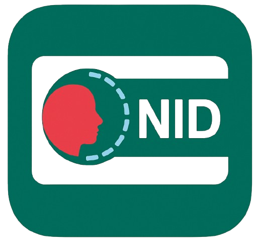

  

# Bangladesh NID OCR System

A complete OCR and face recognition solution for **Bangladeshi National ID cards**, built with **Tesseract**, **OpenCV**, and **InsightFace**. This system supports:

- ✅ Text extraction from scanned or photographed NID cards  
- ✅ Face detection and face matching (e.g., for user verification)  
- ✅ National ID validation for **KYC**, **fintech**, and **government applications**

---

🔗 **Live Demo Viewer**  
👉 [Click here to try the live NID OCR Viewer](https://bd-nid-ocr.braintechsolution.com/)

---

## 🚀 Features

- OCR using **Tesseract**
- Face detection and verification with **InsightFace (ArcFace)**
- Image preprocessing with **OpenCV**
- Supports **Bangla and English** text
- Async and high performance
- Easily integrable into Python backend

---

## 🛠️ Technologies Used

- `Python` *(depending on your backend)*
- Tesseract OCR
- OpenCV
- InsightFace (ONNX)
- REST APIs

---

## 📦 Use Cases

- KYC onboarding
- Fintech identity verification
- Government e-services
- SIM registration
- Voter ID validation

---

## 🙌 Contributing

Feel free to fork the repo and submit pull requests. For major changes, open an issue to discuss the proposed update.

---

## 📌 License

This project is open-source under the [MIT License](LICENSE).

---

## 🤝 Connect

Made with ❤️ for Bangladesh by **Md. Asiqur Rahman Khan**  
🔗 [LinkedIn – linkedin.com/in/asiqur-rahman](https://www.linkedin.com/in/asiqur-rahman)

## ⚠️ Note

> 🧠 The backend for this demo is running on a **Raspberry Pi 4**, which may occasionally be offline due to resource limits.  
> 📲 **Need help or notice the service is down?**  
> Feel free to [message me on WhatsApp](https://wa.me/8801521394572) anytime or scan the QR on the live site.

  

